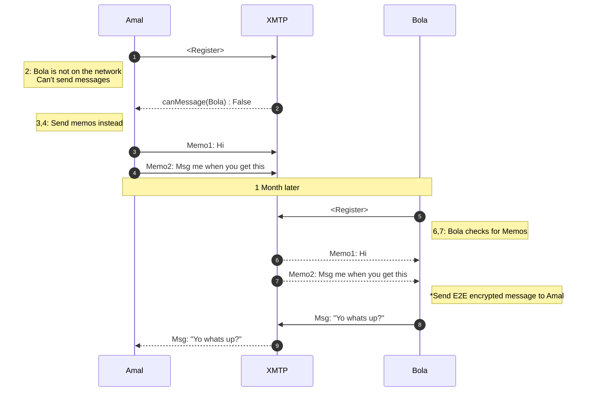

# XMTP-MEMO-JS


## XMTP client SDK for Pre-Registration messaging

:warning: :warning: :warning: XMTP:Memos are available as an early Developer Preview. The api will change without warning and may not be backwards compatible :warning: :warning: :warning:

`xmtp-memo-js` provides a TypeScript implementation of an XMTP memo client. Build with `xmtp-memo-js` to send 'messages' to a blockchain wallet address which has not yet registered on the XMTP network. `xmtp-memo-js` supports use-cases where content needs to be sent to a account which has not registered yet.

### What is a memo?

Memo's are similar to XMTP Messages. They both share the same payload however are used in different circumstances.

- Memos allow developers to send messages to any EVM compatible blockchain address
- Messages allow developers to send End-to-End encrypted messages to any users registered on the XMTP:Network.

When possible developers should always send messages with [XMTP-JS](https://github.com/xmtp/xmtp-js) to benefit from higher security, and stability.

### Memo Sequence



## :warning: :warning: :warning: Security Notice :warning: :warning: :warning

`xmtp-memo-js` uses [Lit protocol](https://developer.litprotocol.com/) to secure memos, and do not carry the same security characteristics as XMTP messages.

- Memos are **NOT** End-to-end encrypted. The encryption key is stored in the Lit Network and is only as secure as the escrow service.
- Memos have **NOT** undergone a formal security audit.

## Installation

[TODO]

### Initialization

A `MemoClient` can be constructed from a AuthSig and a valid XmtpClient

```ts
import { Client } from "@xmtp/xmtp-js";
import { Wallet } from "ethers";
import { SiweMessage } from "lit-siwe";

import { MemoClient } from "../src";
import { genAuthSig, requiredSiweResource } from "../src/crypto/AuthSig";

// You'll want to replace this with a wallet from your application
const wallet = Wallet.createRandom();
// Create the client with your wallet. This will connect to the XMTP development network by default
const client = await Client.create(wallet);

// Build a SignInWithEthereum signature. You can re-use your existing sign in signature by adding the required resource
const siweMessage = new SiweMessage({
  domain: "acme.com",
  address: wallet.address,
  statement: "This is a signature used for testing",
  uri: "https://app.acme.com",
  version: "1",
  chainId: 1,
  resources: [requiredSiweResource()],
});
const authSig = await genAuthSig(wallet, siweMessage.prepareMessage());

// Create the memo client based on the XMTP client.
const memoClient = await MemoClient.create(authSig, client);

```

### Sending a Memo

Memos do not require that the recipient address has been registered on the XmtpNetwork. The Memo payload

```ts
// Send a memo. There is no requirement that this address exists on the XTMP network.
memoClient.sendMemo('0x0000000000000000000000000000000000000000', "Gm!")
```

### Listing Memos

You can retrieve the memos that were sent to your account.

```ts
for (const memo of await receiver.listAllMemos()) {
    console.log(memo);
}
```

## AuthSignatures

The AuthSig is the credential that is used to verify a user on the Lit network.

To decrypt memos the AuthSig must:

- Be signed with the recipient address
- Be a valid Sign-In-With-Ethereum payload
- Contain the XMTP resource ( use: `requiredWSiweResource()`)
