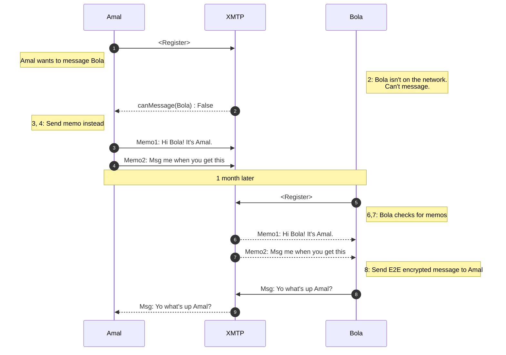

# XMTP-MEMO-JS


## XMTP client SDK for pre-registration messaging

`xmtp-memo-js` provides a TypeScript implementation of an XMTP memo client.

With XMTP, a blockchain account must be registered on the XMTP network to send and receive end-to-end encrypted messages. Build your app with `xmtp-memo-js` to enable a registered account to start communicating with an unregistered account by sending a memo instead of a message.

:warning: :warning: :warning: `XMTP:Memos` are available as an early Developer Preview. :warning: :warning: :warning: <br>
The memo API will change without warning and may not be backward compatible.

### What is a memo?

Memos are not the same as XMTP messages, though they are similar. For example, the payload structure of memos and messages is the same, but memos and messages are used in different circumstances.

- Memos allow a registered account to send messages that are **not end-to-end encrypted** to **any Ethereum Virtual Machine-compatible blockchain account**.
- Messages allow a registered account to send **end-to-end encrypted messages** to **any account registered on the XMTP network**.

When possible, developers should always send messages with [XMTP-JS](https://github.com/xmtp/xmtp-js) to benefit from higher security and stability.

### Memo sequence



## :warning: :warning: :warning: Security notice :warning: :warning: :warning:

`xmtp-memo-js` uses [Lit protocol](https://developer.litprotocol.com/) to secure memos. Memos do not carry the same security characteristics as XMTP messages.

- Memos are **NOT** end-to-end encrypted. The memo encryption key is stored in the Lit Network and is only as secure as the escrow service.
- Memos have **NOT** undergone a formal security audit.

## Install

[TODO]

## Initialize

Construct a `MemoClient` from an AuthSig and a valid XmtpClient. For example:

```ts
import { Client } from "@xmtp/xmtp-js";
import { Wallet } from "ethers";
import { SiweMessage } from "lit-siwe";

import { MemoClient } from "../src";
import { genAuthSig, requiredSiweResource } from "../src/crypto/AuthSig";

// You'll want to replace this with a wallet from your application
const wallet = Wallet.createRandom();
// Create the client with your wallet. This will connect to the XMTP development network by default
const client = await Client.create(wallet);

// Build a SignInWithEthereum signature. You can reuse your existing sign-in signature by adding the required resource
const siweMessage = new SiweMessage({
  domain: "acme.com",
  address: wallet.address,
  statement: "This is a signature used for testing",
  uri: "https://app.acme.com",
  version: "1",
  chainId: 1,
  resources: [requiredSiweResource()],
});
const authSig = await genAuthSig(wallet, siweMessage.prepareMessage());

// Create the memo client based on the XMTP client.
const memoClient = await MemoClient.create(authSig, client);

```

## Send a memo

Memos don't require that the recipient account be registered on the XMTP network. Here is an example Memo payload:

```ts
// Send a memo. There is no requirement that this account be registered on the XTMP network.
memoClient.sendMemo('0x0000000000000000000000000000000000000000', "Gm!")
```

## List memos

Here is an example of how to retrieve and list memos for an account:

```ts
for (const memo of await receiver.listAllMemos()) {
    console.log(memo);
}
```

## Use AuthSignatures

The Lit network uses the AuthSig credential to verify a user.

To decrypt memos, the AuthSig must:

- Be signed with the recipient address
- Be a valid Sign-In with Ethereum (SIWE) payload
- Contain the XMTP resource (use: `requiredWSiweResource()`)
